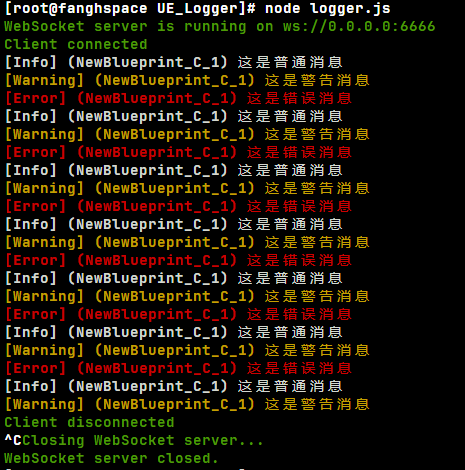

# Unreal Logger

1. 一个可跨平台，简单，轻量，易维护的UE日志工具
2. 解决UE项目打包发行版后，查看项目中手动添加的PrintLog等相关操作，无法轻易查看日志的问题
3. 基于WebSocket通信，可以本地使用，也可以部署云端

### 1. 结构介绍

UnrealLogger

- UE_Logger
  - node_modules
  - logger.js `Logger Server`
  - package.json
  - package-lock.json
  - websocat.exe `Windows Test Websocket Tool`
- UnrealLogger `UE Plugin`
- .gitignore
- README.md

`Logger Server`：使用`nodejs`开发

`UE Plugin`：使用`UE 5.2`开发，纯源码，需要使用C++项目编译，只用了`UE`模块，理论上该插件也支持全平台，足够多的UE版本

`websocat.exe`：启动`Logger Server`后，在`Windows`平台，可以简单使用该测试是否启用成功

### 2. 使用前提

1. 系统运行环境需要`nodejs, npm`等
2. UE项目是C++项目，添加该插件后，项目编译成功

### 3. 使用方法

#### 部署LoggerServer

1. 使用控制台进入`UE_Logger`目录

2. 运行`node logger.js`启动 `Logger Server`

   - 默认启动的是 `127.0.0.1:6666`, 刷新间隔 `16ms`
   - 使用带参命令 `node logger.js 127.0.0.1 7777 100`可以该`Logger Server`的`IP, Port, 刷新间隔`
   - `node logger.js <IP> <Port> <Interval>`

3. 启动后，在`Windows`环境下，可以直接使用`websocat.exe`测试

   - 建议新开一个控制台，同样的目录下`websocat.exe ws://127.0.0.1:6666`

     

   - 测试数据：

     - `{"level":0, "content":"这是普通日志"}`
     - `{"level":1, "content":"这是警告日志"}`
     - `{"level":2, "content":"这是错误日志"}`

     

#### UE 插件使用

>注意：使用前，先确保 Logger Server已经启动，并测试通过
>
>如果：先启动了UE 客户端，再启动 Logger Server，应该是无法连接的，可以在客户端程序中，可以手动或特定时机触发 MakeLoggerSetting方法

1. 初始化 `Logger System`：初始化相关配置和启动`WebSocket`服务

   

2. 查看`PrintLog`方法

   

3. `Log Type`介绍：

   - Normal -> level: 0
   - Warning -> level: 1
   - Error -> level:2

4. `Log Setting`：

   

5. `Log Screen Color`，`Log Screen Time`和 `UE printString`同理

6. 测试蓝图：

   

   运行结果：

   

   

7. 结束打印

   

### 4. UE客户端可能出现的问题

如果你电脑挂了代理，这个应该是代理的问题，关掉代理再测试

### 5. 云端部署

1. 测试了一个Linux服务器，开发防火墙的`6666`端口
2. 配置运行环境
3. `node logger.js 0.0.0.0:6666`
4. 在本地主机（windows）: `websocat.exe ws://公网IP:6666`即可

### 补充更新

#### 2024-10-16

多了一个 `IsUseWorldContextName`，目的是方便查看日志打印时，可以看见这条日志打印的所在位置，比如：`UI, Actor, Level`等等；

优化了`Logger Server`的打印样式，使用绿色显示连接状态

#### 2024-10-18

发送给`Logger Server`的日志，默认增加了时间戳 `UE 发送日志的时间`

